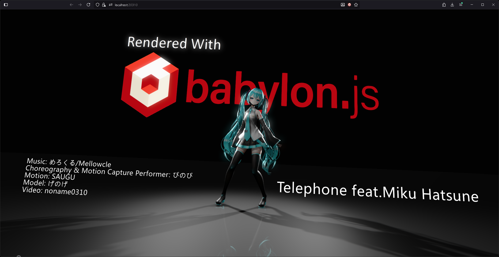

# babylon-mmd-showcase



## Overview

This repository is a small proof-of-concept demonstrating how far you can push Babylon.js’ rendering pipeline to produce a polished MMD scene. It ties together advanced lighting, post-processing, and camera work with the `babylon-mmd` runtime to showcase a cinematic workflow.

## Required external assets

To run the project you must manually download two external assets referenced in comments inside `sceneBuilder.ts`, then place them under the matching paths in the `res/` directory.

1. **Motion & music**: Grab the VMD / MP3 from [YouTube – Telephone(Music Video)/Mellowcle feat.Miku Hatsune](https://www.youtube.com/watch?v=o0SNzFbNo4g) and drop the files into `res/private_test/Telephone/`.
2. **Model**: Download the Miku model from [BowlRoll – げのげ式初音ミク](https://bowlroll.net/file/320915), extract it, and copy the original folder structure to `res/private_test/げのげ式初音ミク/`.

> ⚠️ Please review each asset’s license and terms of use, and keep your usage to personal learning or demonstrations only.

## Install & run

```pwsh
# Install dependencies
npm install

# Launch the dev server (http://localhost:8080 by default)
npm start
```

## Project layout

- `src/sceneBuilder.ts`: Builds the scene, initializes the MMD runtime, and configures lighting, materials, and post-processing.
- `src/index.ts`: Wires the Babylon.js engine to `SceneBuilder` and renders the scene into the canvas.
- `res/`: Static resources plus the manually downloaded model, motion, and texture files.
